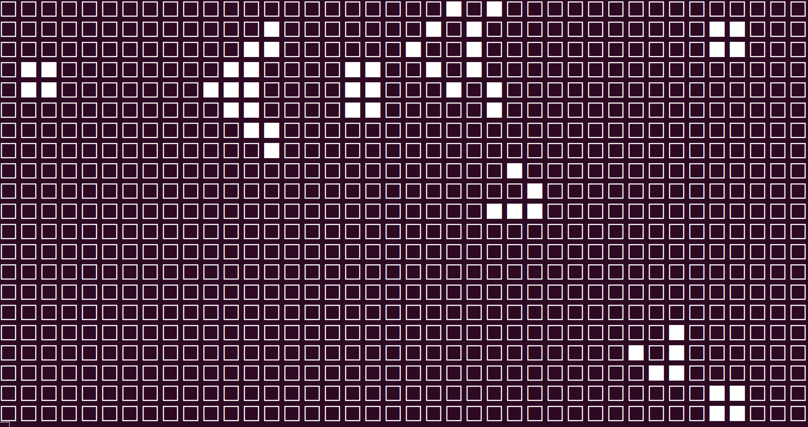

# Simulateur du jeu de la vie 

Implémentation ARMv8 du [jeu de la vie de Conway](https://fr.wikipedia.org/wiki/Jeu_de_la_vie). À exécuter avec la commande:

```
 make && ./simuler.sh fichier
```




Afin de tester avec les grilles fournies, exécutez:

```
 make && ./simuler.sh grille1.txt
```
ou
```
 make && ./simuler.sh grille2.txt
```

Si `simuler.sh` n'a pas les droits d'exécution, exécutez d'abord la commande:
```
 chmod +x simuler.sh
```

## Pour les curieux et curieuses

* Mise au point d'un processeur + jeu d'instructions pour implémenter Tetris dans le jeu de la vie: https://codegolf.stackexchange.com/a/142673.
