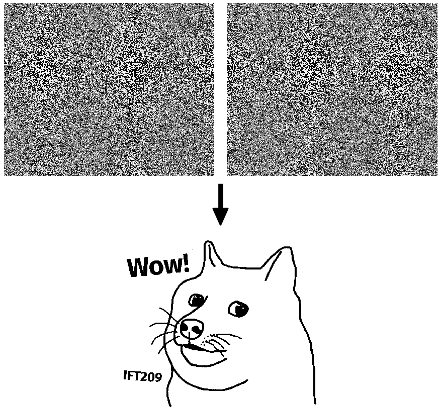

# Cryptographie visuelle

Implémentation du déchiffrement d'une variante de [cryptographie visuelle](https://fr.wikipedia.org/wiki/Cryptographie_visuelle) à base de [masque jetable](https://fr.wikipedia.org/wiki/Masque_jetable) pour le [format PBM](https://fr.wikipedia.org/wiki/Portable_pixmap). Les deux clés secrètes peuvent être déchiffrées à l'aide de:

```
 make && (cat cle1.pbm cle2.pbm | ./dechiffrer) > image.pbm

```
Ces deux clés reproduiront cette image:


