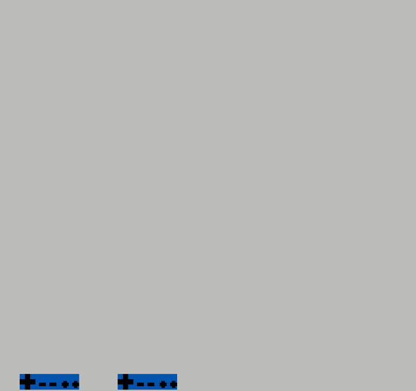

# Exemple de programme simple sur NES

- Fait défiler un *sprite* de gauche à droite en continu;
- Le *sprite* alterne entre les tuiles des caractères 0, 1, 2, ..., 9;
- Lorsqu'on appuie sur le bouton A, le *sprite* se déplace vers le bas.

## Exécution

Afin de compiler et d'exécuter le code, consultez [ces instructions](http://info.usherbrooke.ca/mblondin/ift209/nes/instructions.pdf).

## Aperçu

