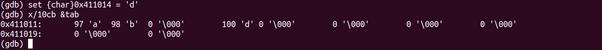

# Boutisme: exemple de bogue sournois

À bien des égards, le boutisme n'est qu'une convention qui n'a pas d'incidence; de la même manière que les voitures
peuvent circuler sans problème à droite au Québec et à gauche en Irlande. Cependant, certains comportements subtils peuvent surgir à
l'occasion si on n'en tient pas compte; ce qui devrait être assez clair avec l'analogie des voitures! Ce court billet donne un
tel exemple inspiré d'une erreur repérée lors de la correction du laboratoire 3.

## Ordre des octets

Rappelons que le boutisme («endianness») indique dans quel ordre on stocke les octets d'une unité de mémoire de plusieurs octets.
Sous la convention petit-boutiste («little-endian») on stocke d'abord les octets de poids faible, alors que sous
la convention grand-boutiste («big-endian») on stocke d'abord les octets de poids fort. Par exemple, la valeur ```0x61```
stockée sur 8 octets à l'adresse ```a``` en mémoire principale est organisée de cette façon sous ces deux conventions:

|adresse|contenu (petit-boutiste)|contenu (grand-boutiste)|
|:-:|:-:|:-:|
|```a+0```|```0x61```|```0x00```|
|```a+1```|```0x00```|```0x00```|
|```a+2```|```0x00```|```0x00```|
|```a+3```|```0x00```|```0x00```|
|```a+4```|```0x00```|```0x00```|
|```a+5```|```0x00```|```0x00```|
|```a+6```|```0x00```|```0x00```|
|```a+7```|```0x00```|```0x61```|

## Exemple de programme qui dépend du boutisme 

Considérons le programme ARMv8 ci-dessous qui cherche à lire dix caractères (d'un octet) au clavier et à les stocker dans un tableau ```tab```
(comme pour la lecture de la carte au labo 3).
Le code est correct à l'exception de l'instruction ```str   x21, [x19, x20]``` qui est problématique. En effet, elle stocke le caractère ```c```
lu du flux d'entrée vers ```tab[i]``` mais sur *8 octets* plutôt qu'un seul (on devrait utiliser ```strb```). Pourtant, ce programme se termine
sans erreur avec les dix caractères bien stockés dans ```tab```.

```c
.global main

// Lit 10 caractères et les stocke dans tab
main:                     //
    adr   x19, tab        //
    mov   x20, 0          // i = 0
                          //
boucle:                   //
    cmp   x20, 10         // while (i != 0) {
    b.eq  fin             //
                          //
    adr   x0, fmtChar     //
    adr   x1, temp        //
    bl    scanf           //   scanf(" %c", &temp)
    adr   x22, temp       //
    ldrb  w21, [x22]      //   c = temp
                          //
    str   x21, [x19, x20] //   tab[i] = c  // Stockage d'un octet sur 8 octets!
                          //
    add   x20, x20, 1     //   i++
    b     boucle          // }
                          //
fin:                      //
    mov   x0, 0           //
    bl    exit            // exit(0)

.section ".rodata"
fmtChar:  .asciz  " %c"

.section ".bss"
temp:     .skip   1
tab:      .skip   17

```

## Le code sous la loupe du débogueur

En lançant le programme avec le débogueur ```gdb```, on voit que ```tab``` contient initialement dix caractères nuls:


En entrant le caractère ```'a'``` puis le caractère ```'b'``` au clavier, on stocke bien leur code respectif
dans les deux premiers octets de ```tab``` (et ce malgré l'usage de ```str``` plutôt que ```strb```):


Cela fonctionne car nous utilisons l'architecture ARMv8 configurée sous petit-boutisme. En effet, il
se produit quelque chose d'à priori imperceptible. Utilisons le débogueur afin de stocker manuellement le caractère
```'d'``` (dont le code est ```100 = 0x64```) dans le quatrième octet du tableau ```tab```:



En lisant ensuite le caractère ```'c'``` au clavier, on stocke bien son code dans le troisième octet de ```tab```,
mais cela fait disparaître ```'d'``` qui était pourtant au quatrième octet:


Voyons pourquoi. Remarquons que ```tab``` est situé à l'adresse ```0x411011```. Avant d'entrer ```'c'``` au clavier,
nous avions ce contenu:

|adresse|contenu|
|:-:|:-:|
|```0x411011```|```0x61```|
|```0x411012```|```0x62```|
|```0x411013```|```0x00```|
|```0x411014```|```0x64```|
|```0x411015```|```0x00```|
|```0x411016```|```0x00```|
|```0x411017```|```0x00```|
|```0x411018```|```0x00```|
|```0x411019```|```0x00```|
|```0x41101A```|```0x00```|


Le code numérique de ```'c'``` est ```99 = 0x63```. Ainsi, en le stockant à l'adresse ```0x411013``` sur 8 octets
avec ```str```, on stocke ```0x63 0x00 0x00 0x00 0x00 0x00 0x00 0x00``` (petit-boutisme), ce qui efface le caractère ```'d'```:

|adresse|contenu|
|:-:|:-:|
|```0x411011```|```0x61```|
|```0x411012```|```0x62```|
|**```0x411013```**|**```0x63```**|
|**```0x411014```**|**```0x00```**|
|**```0x411015```**|**```0x00```**|
|**```0x411016```**|**```0x00```**|
|**```0x411017```**|**```0x00```**|
|**```0x411018```**|**```0x00```**|
|**```0x411019```**|**```0x00```**|
|**```0x41101A```**|**```0x00```**|

Par conséquent, chaque stockage avec ```str``` stocke sept octets nuls en trop, mais comme cela se fait sous petit-boutisme,
le code du caractère est stocké au bon endroit et non sept octets trop loin.

## Et sous grand-boutisme?

Si nous utilisions ARMv8 sous la convention grand-boutiste, ***le programme n'accomplirait pas sa tâche correctement***.
En effet, dès la lecture du caractère ```'a'```, dont le code est ```91 = 0x61```, nous aurions obtenu:

|adresse|contenu|
|:-:|:-:|
|```0x411011```|```0x00```|
|```0x411012```|```0x00```|
|```0x411013```|```0x00```|
|```0x411014```|```0x00```|
|```0x411015```|```0x00```|
|```0x411016```|```0x00```|
|```0x411017```|```0x00```|
|**```0x411018```**|**```0x61```**|
|```0x411019```|```0x00```|
|```0x41101A```|```0x00```|

## Autre source d'erreur

Remarquons que le programme effectue des accès mémoire dangereux à partir de la quatrième lecture: comme il manipule sept
octets en trop, il accède à la mémoire au-delà de ```tab```. Cela ne cause pas d'erreur ici car ```tab``` contient
volontairement 17 octets. En fait, sur ma machine, même en n'allouant que 10 octets, par (mal)chance il n'y a aucune
erreur de segmentation qui nous avertit du comportement!
